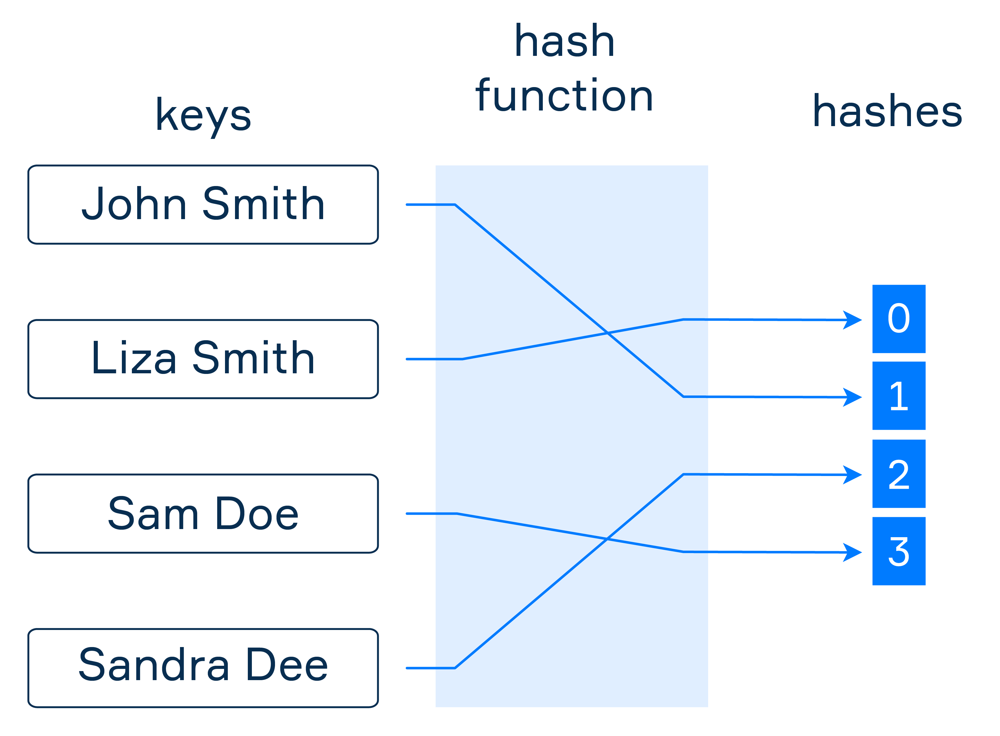

# Hash function
>Tags: #cs #hash #algorythms 

**Hash function** is used to convert data of arbitrary sized input to a unique value. Result of this function can be used as index in [Hash table](hash-table.md)

## Links
- [hash](hash.md)